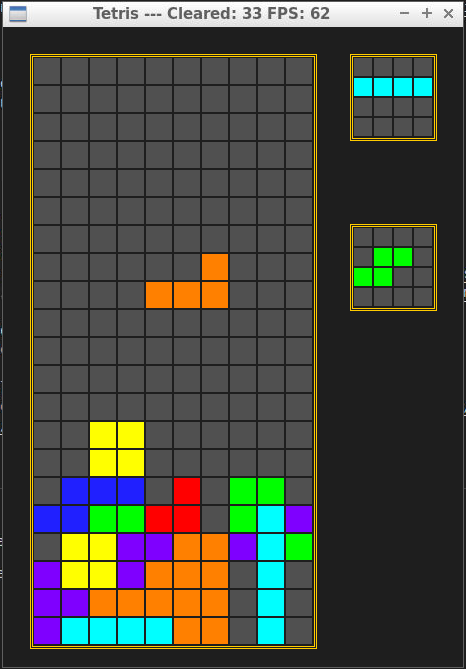
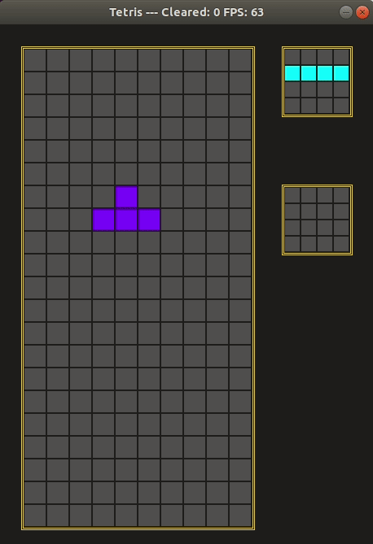

# CPPND: Capstone Tetris!

This is my Tetris clone Capstone project in the [Udacity C++ Nanodegree Program](https://www.udacity.com/course/c-plus-plus-nanodegree--nd213). 

This is the classic Russian puzzle game where you drop pieces strategically to complete as many lines as you can, while avoiding the pieces to stack up to the top. In this version I added the handy next piece preview and the hability to store a piece for later use(which can be easily abused!).

* Keybindings
  * LEFT, RIGHT and DOWN arrows move the piece.
  * UP arrow will rotate the piece.
  * RIGHT CTRL will store the piece or swap it if one is already stored.
  * SPACE BAR will slam the piece down (this can be glitchy).

* Known BUGS
  * Using SLAM when a piece is about to go down causes clipping
  * When clearing multiple non contiguous lines the shifted lines are not correctly calculated

## Dependencies for Running Locally
* cmake >= 3.7
  * All OSes: [click here for installation instructions](https://cmake.org/install/)
* make >= 4.1 (Linux, Mac), 3.81 (Windows)
  * Linux: make is installed by default on most Linux distros
  * Mac: [install Xcode command line tools to get make](https://developer.apple.com/xcode/features/)
  * Windows: [Click here for installation instructions](http://gnuwin32.sourceforge.net/packages/make.htm)
* SDL2 >= 2.0
  * All installation instructions can be found [here](https://wiki.libsdl.org/Installation)
  >Note that for Linux, an `apt` or `apt-get` installation is preferred to building from source. 
* gcc/g++ >= 5.4
  * Linux: gcc / g++ is installed by default on most Linux distros
  * Mac: same deal as make - [install Xcode command line tools](https://developer.apple.com/xcode/features/)
  * Windows: recommend using [MinGW](http://www.mingw.org/)

## Basic Build Instructions

1. Clone this repo.
2. Make a build directory in the top level directory: `mkdir build && cd build`
3. Compile: `cmake .. && make`
4. Run it: `./Tetris`.

# Rubric requirements

## Loops, Functions, I/O

* The project accepts user input and processes the input.
  * See [controller.cpp](https://github.com/Jaredkmacho/CppND-Capstone-Tetris/blob/main/src/controller.cpp) where SDL keyboard events are used to get input from the user.
 
## Object Oriented Programming

* The project uses Object Oriented Programming techniques. 
  * See [Tetris.h](https://github.com/Jaredkmacho/CppND-Capstone-Tetris/blob/main/src/tetris.h) for classes like Tetris or Piece that encapsulates attributes and methods.

* Classes use appropriate access specifiers for class members.
  * See [Piece class](https://github.com/Jaredkmacho/CppND-Capstone-Tetris/blob/main/src/tetris.h#L29-L67) where access specifiers are used.

* Classes encapsulate behavior.
  * See [Piece::Rotate() method](https://github.com/Jaredkmacho/CppND-Capstone-Tetris/blob/5b2aa8ccc6276eaed3337273062153d2cbddbdd5/src/tetris.cpp#L357-L397) where Piece attributes are modified according to the expected behavior in Tetris.

* Classes follow an appropriate inheritance hierarchy.
  * See [controller.h](https://github.com/Jaredkmacho/CppND-Capstone-Tetris/blob/main/src/controller.h) where the abstract class Command is used as a base for more specific Commands, also the class Controller is composed of many Commands.

* Overloaded functions allow the same function to operate on different parameters. 
  * See [Tetris::spawnPiece() method](https://github.com/Jaredkmacho/CppND-Capstone-Tetris/blob/5b2aa8ccc6276eaed3337273062153d2cbddbdd5/src/tetris.cpp#L710-L732).

* Derived class functions override virtual base class functions.
  * See [setSprite() method](https://github.com/Jaredkmacho/CppND-Capstone-Tetris/blob/5b2aa8ccc6276eaed3337273062153d2cbddbdd5/src/tetris.h#L69-L116) in every Piece derived class.

* Templates generalize functions in the project. 
  * See [template spawnerFor class](https://github.com/Jaredkmacho/CppND-Capstone-Tetris/blob/5b2aa8ccc6276eaed3337273062153d2cbddbdd5/src/tetris.h#L125-L129) that can be used with any of the Piece derived classes. 

## Memory Management

* The project makes use of references in function declarations. 
  * Many methods in Tetris, Playfield and Piece class use pass-by-reference in function declarations.

>  TODO: Add more memory management good practices like RAII and smart pointers.

## Concurrency

>  TODO: Add concurrency with audio events running in different threads. 

## CC Attribution-ShareAlike 4.0 International

Shield: [![CC BY-SA 4.0][cc-by-sa-shield]][cc-by-sa]

This work is licensed under a
[Creative Commons Attribution-ShareAlike 4.0 International License][cc-by-sa].

[![CC BY-SA 4.0][cc-by-sa-image]][cc-by-sa]

[cc-by-sa]: http://creativecommons.org/licenses/by-sa/4.0/
[cc-by-sa-image]: https://licensebuttons.net/l/by-sa/4.0/88x31.png
[cc-by-sa-shield]: https://img.shields.io/badge/License-CC%20BY--SA%204.0-lightgrey.svg
